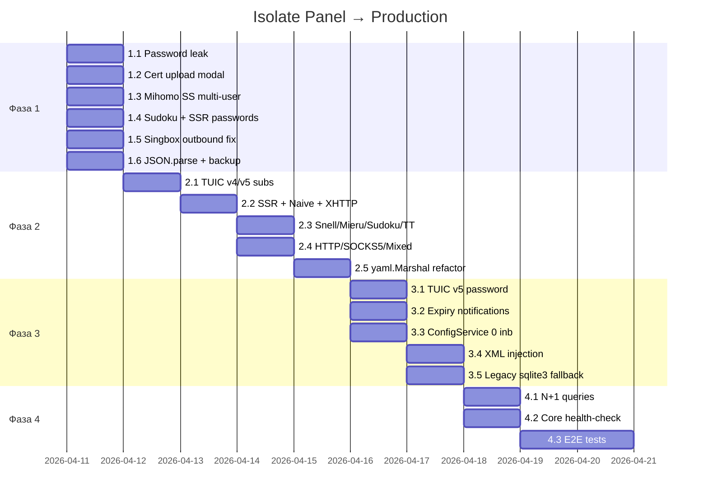

# План реализации: Isolate Panel → Production-Ready

## Цель

Довести панель с текущих ~84% до 100% функциональной готовности. Исправить 14 оставшихся багов, добавить подписки для 12 протоколов, устранить архитектурные уязвимости.

**Оценка**: 4 фазы, ~8-10 рабочих дней.

---

## Фаза 1: Критические баги (1-2 дня)

Блокеры, без которых панель нефункциональна или небезопасна.

---

### 1.1 Утечка пароля в API-ответе

**Файл**: [user_service.go:53-67](file:///mnt/Games/syncthing-shared-folder/isolate-panel/backend/internal/services/user_service.go#L53-L67)

**Проблема**: `UserResponse.Password` с тегом `json:"password,omitempty"` возвращает plaintext-пароль при каждом GET/LIST.

**Решение**:
- Убрать `Password` из `UserResponse`
- Создать отдельный `CreateUserResponse` с полем `Password` — возвращать только в ответе на POST `/api/users`
- В хендлере `GetUser` / `ListUsers` использовать `UserResponse` без пароля

```diff
// UserResponse — для GET/LIST (без пароля)
 type UserResponse struct {
     ID                uint    `json:"id"`
     Username          string  `json:"username"`
     Email             string  `json:"email"`
     UUID              string  `json:"uuid"`
-    Password          string  `json:"password,omitempty"`
     Token             *string `json:"token,omitempty"`
     ...
 }

+// CreateUserResponse — только для POST (с паролем)
+type CreateUserResponse struct {
+    UserResponse
+    Password string `json:"password"`
+}
```

---

### 1.2 Модал загрузки сертификата

**Файл**: [Certificates.tsx:280-323](file:///mnt/Games/syncthing-shared-folder/isolate-panel/frontend/src/pages/Certificates.tsx)

**Проблема**: `<textarea>` без `value`/`onChange`, кнопка «Upload» без `onClick` — форма полностью нефункциональна.

**Решение**:
- Добавить state: `const [certPem, setCertPem] = useState('')` и `const [keyPem, setKeyPem] = useState('')`
- Привязать `value={certPem}` и `onChange={e => setCertPem(e.target.value)}`
- В onClick отправить `POST /api/certificates/upload` с `{ cert_pem, key_pem, domain }`
- Добавить валидацию: оба поля обязательны, минимальная проверка на `-----BEGIN`

---

### 1.3 Mihomo Shadowsocks multi-user

**Файл**: [mihomo/config.go:180-186](file:///mnt/Games/syncthing-shared-folder/isolate-panel/backend/internal/cores/mihomo/config.go#L180-L186)

**Проблема**: `proxy.Password = users[0].UUID` — только первый пользователь.

**Решение**:

1. Вынести парсинг `inbound.ConfigJSON` в начало функции `convertInboundToProxy` (до switch):
```go
var cfgSettings map[string]interface{}
if inbound.ConfigJSON != "" {
    json.Unmarshal([]byte(inbound.ConfigJSON), &cfgSettings)
}
if cfgSettings == nil {
    cfgSettings = make(map[string]interface{})
}
```

2. Переписать `case "shadowsocks"`:
```go
case "shadowsocks":
    proxy.Cipher = getStringOrDefault(cfgSettings, "method", "2022-blake3-aes-128-gcm")
    if serverPass, ok := cfgSettings["password"].(string); ok {
        proxy.Password = serverPass
    }
    if len(users) > 0 {
        proxy.Users = make([]ProxyUser, len(users))
        for i, user := range users {
            proxy.Users[i] = ProxyUser{
                Name:     fmt.Sprintf("user_%d", user.ID),
                Password: user.UUID,
            }
        }
    }
```

3. **Для не-2022 ciphers** (aes-256-gcm, chacha20-poly1305): multi-user не поддерживается нативно в Mihomo. **Принятое решение**: используем `users[0]` с warning в логах:
```go
    // For non-2022 ciphers, multi-user is not supported by Mihomo
    if !strings.HasPrefix(proxy.Cipher, "2022-") && len(users) > 1 {
        logger.Log.Warn().Str("inbound", inbound.Name).Int("user_count", len(users)).
            Msg("Mihomo SS with AEAD cipher supports only 1 user; using first user")
        proxy.Password = users[0].UUID
    }
```

4. Добавить хелпер `getStringOrDefault` в пакет mihomo (аналогичный subscription_service).

---

### 1.4 Sudoku hardcoded пароль

**Файл**: [mihomo/config.go:256-259](file:///mnt/Games/syncthing-shared-folder/isolate-panel/backend/internal/cores/mihomo/config.go#L256-L259)

**Проблема**: `proxy.Password = "sudoku-password"` — hardcoded вместо чтения из ConfigJSON.

**Решение**: Читать пароль из ConfigJSON (который уже заполняется через `AutoGenFunc: "generate_password_16"`):
```go
case "sudoku":
    proxy.Type = "sudoku"
    if pass, ok := cfgSettings["password"].(string); ok {
        proxy.Password = pass
    }
```

Аналогично исправить `case "ssr"` — `proxy.Protocol` и `proxy.Obfs` тоже hardcoded:
```go
case "ssr":
    proxy.Type = "ssr"
    proxy.Protocol = getStringOrDefault(cfgSettings, "protocol", "origin")
    proxy.Obfs = getStringOrDefault(cfgSettings, "obfs", "plain")
    proxy.Cipher = getStringOrDefault(cfgSettings, "method", "chacha20-poly1305")
    if len(users) > 0 {
        proxy.Password = users[0].UUID
    }
```

---

### 1.5 Sing-box outbound теряет ConfigJSON

**Файл**: [singbox/config.go:684-692](file:///mnt/Games/syncthing-shared-folder/isolate-panel/backend/internal/cores/singbox/config.go#L684-L692)

**Проблема**: `convertOutbound()` создаёт OutboundConfig с пустым Extra — ConfigJSON игнорируется.

**Решение**:
```go
func convertOutbound(outbound models.Outbound) (*OutboundConfig, error) {
    singboxType := mapSingboxOutboundProtocol(outbound.Protocol)
    tag := fmt.Sprintf("%s_%d", outbound.Protocol, outbound.ID)
    extra := make(map[string]interface{})
    if outbound.ConfigJSON != "" {
        if err := json.Unmarshal([]byte(outbound.ConfigJSON), &extra); err != nil {
            logger.Log.Warn().Err(err).Uint("outbound_id", outbound.ID).Msg("Failed to parse outbound ConfigJSON")
        }
    }
    return &OutboundConfig{Type: singboxType, Tag: tag, Extra: extra}, nil
}
```

---

### 1.6 JSON.parse без try/catch

**Файл**: [main.tsx:7](file:///mnt/Games/syncthing-shared-folder/isolate-panel/frontend/src/main.tsx#L7)

**Проблема**: `JSON.parse(savedTheme)?.state?.theme` — если localStorage содержит невалидный JSON, приложение падает при старте.

**Решение**:
```typescript
let theme = 'dark'
try {
  const savedTheme = localStorage.getItem('isolate-theme-storage')
  if (savedTheme) {
    theme = JSON.parse(savedTheme)?.state?.theme ?? 'dark'
  }
} catch {
  // corrupted localStorage — use default
}
```

---

### 1.7 Backup SetSchedule — UPDATE без WHERE

**Файл**: [backup_service.go:1055](file:///mnt/Games/syncthing-shared-folder/isolate-panel/backend/internal/services/backup_service.go#L1055)

**Проблема**: `s.db.Model(&models.Backup{}).Update("schedule_cron", "")` — обновляет **все** записи Backup (GORM без WHERE на пустой модели).

**Решение**:
```go
s.db.Model(&models.Backup{}).Where("schedule_cron IS NOT NULL AND schedule_cron != ''").Update("schedule_cron", "")
```

---

## Фаза 2: Подписки для всех протоколов (3-4 дня)

Добавить генерацию ссылок во **все три метода** subscription_service.go для 12 протоколов.

---

### 2.1 Затрагиваемые методы

| Метод | Формат | Файл:строки |
|-------|--------|-------------|
| `generateProxyLink()` | V2Ray URI (base64) | [subscription_service.go:378-406](file:///mnt/Games/syncthing-shared-folder/isolate-panel/backend/internal/services/subscription_service.go#L378-L406) |
| `generateClashProxy()` | Clash YAML | [subscription_service.go:468-507](file:///mnt/Games/syncthing-shared-folder/isolate-panel/backend/internal/services/subscription_service.go#L468-L507) |
| `generateSingboxOutbound()` | Sing-box JSON | [subscription_service.go:510-597](file:///mnt/Games/syncthing-shared-folder/isolate-panel/backend/internal/services/subscription_service.go#L510-L597) |

### 2.2 Матрица реализации

| # | Протокол | V2Ray URI | Clash YAML | Sing-box JSON |
|---|----------|-----------|------------|---------------|
| 1 | TUIC v4 | `tuic://token@s:p?congestion_control=bbr&alpn=h3` | type: tuic, version: 4, token | type: tuic, uuid, password |
| 2 | TUIC v5 | `tuic://uuid:pass@s:p?congestion_control=bbr&alpn=h3` | type: tuic, version: 5, uuid, password | type: tuic, uuid, password |
| 3 | NaiveProxy | `naive+https://user:pass@s:p` | ❌ skip | type: naive, username, password |
| 4 | XHTTP | `vless://uuid@s:p?type=xhttp&security=tls` | ❌ skip | ❌ skip |
| 5 | SSR | `ssr://base64(host:port:proto:method:obfs:pass)` | type: ssr, cipher, protocol, obfs | ❌ skip |
| 6 | Snell | ❌ return "" | type: snell, psk, version, obfs-mode | ❌ skip |
| 7 | Mieru | ❌ return "" | type: mieru, password | ❌ skip |
| 8 | Sudoku | ❌ return "" | type: sudoku, password | ❌ skip |
| 9 | TrustTunnel | ❌ return "" | type: trusttunnel, password | ❌ skip |
| 10 | HTTP | `http://user:pass@s:p` | type: http | type: http |
| 11 | SOCKS5 | `socks5://user:pass@s:p` | type: socks5 | type: socks |
| 12 | Mixed | `mixed://user:pass@s:p` | type: mixed | type: mixed |

### 2.3 Пример реализации: TUIC v5

```go
// В generateProxyLink()
case "tuic_v5":
    params := url.Values{}
    params.Set("congestion_control", getStringOrDefault(config, "congestion_control", "bbr"))
    params.Set("alpn", "h3")
    if inbound.TLSEnabled {
        params.Set("security", "tls")
        params.Set("insecure", "1")
    }
    password := user.UUID
    if user.Token != nil {
        password = *user.Token
    }
    return fmt.Sprintf("tuic://%s:%s@%s:%d?%s#%s",
        user.UUID, password, server, inbound.Port,
        params.Encode(), url.PathEscape(inbound.Name))

// В generateClashProxy()
case "tuic_v5":
    return fmt.Sprintf("  - name: %s\n    type: tuic\n    server: %s\n    port: %d\n    uuid: %s\n    password: %s\n    version: 5\n    congestion-controller: %s\n    skip-cert-verify: true\n",
        name, server, inbound.Port, user.UUID, user.UUID,
        getStringOrDefault(config, "congestion_control", "bbr")), name

// В generateSingboxOutbound()
case "tuic_v5":
    ob := map[string]interface{}{
        "type":        "tuic",
        "tag":         inbound.Name,
        "server":      server,
        "server_port": inbound.Port,
        "uuid":        user.UUID,
        "password":    user.UUID,
        "congestion_control": getStringOrDefault(config, "congestion_control", "bbr"),
    }
    if inbound.TLSEnabled {
        ob["tls"] = map[string]interface{}{"enabled": true, "insecure": true}
    }
    return ob
```

### 2.4 Пример реализации: SSR (только V2Ray + Clash)

```go
// В generateProxyLink()
case "ssr":
    method := getStringOrDefault(config, "method", "chacha20-poly1305")
    protocol := getStringOrDefault(config, "protocol", "origin")
    obfs := getStringOrDefault(config, "obfs", "plain")
    // SSR URI: base64(host:port:protocol:method:obfs:base64(password)/?params)
    raw := fmt.Sprintf("%s:%d:%s:%s:%s:%s",
        server, inbound.Port, protocol, method, obfs,
        base64.URLEncoding.EncodeToString([]byte(user.UUID)))
    return "ssr://" + base64.URLEncoding.EncodeToString([]byte(raw))
```

### 2.5 Clash YAML → yaml.Marshal

**Сопутствующий рефакторинг**: перевести `generateClashProxy()` с ручного `fmt.Sprintf` на `yaml.Marshal` для безопасной сериализации имён с спецсимволами YAML.

```go
func (s *SubscriptionService) generateClashProxy(user models.User, inbound models.Inbound) (string, string) {
    proxy := map[string]interface{}{
        "name":   inbound.Name,
        "type":   mapClashProtocol(inbound.Protocol),
        "server": server,
        "port":   inbound.Port,
    }
    // ... protocol-specific fields ...
    data, err := yaml.Marshal([]interface{}{proxy})
    if err != nil {
        return "", ""
    }
    return "  " + string(data), inbound.Name
}
```

### 2.6 json.Unmarshal обработка ошибок

**Файлы**: subscription_service.go:381, 471, 513

Все три места с `json.Unmarshal` без проверки ошибки:
```go
// Было:
json.Unmarshal([]byte(inbound.ConfigJSON), &config)

// Стало:
if err := json.Unmarshal([]byte(inbound.ConfigJSON), &config); err != nil {
    logger.Log.Warn().Err(err).Uint("inbound_id", inbound.ID).Msg("Failed to parse inbound ConfigJSON")
}
```

---

## Фаза 3: Архитектурные улучшения (2-3 дня)

---

### 3.1 TUIC v5 дубликат UUID как password

**Файл**: [singbox/config.go:596-606](file:///mnt/Games/syncthing-shared-folder/isolate-panel/backend/internal/cores/singbox/config.go#L596-L606)

**Проблема**: `Password: user.UUID` — в реальном TUIC v5 UUID и password должны быть разными.

**Решение**: Использовать `user.Token` (генерируется при создании) как пароль TUIC:
```go
case "tuic_v5":
    password := user.UUID
    if user.Token != nil && *user.Token != "" {
        password = *user.Token
    }
    tuicUsers = append(tuicUsers, TUICUser{
        UUID:     user.UUID,
        Password: password,
        Name:     fmt.Sprintf("user_%d", user.ID),
    })
```

---

### 3.2 Expiry notification дубликация

**Файл**: [user_service.go:354-381](file:///mnt/Games/syncthing-shared-folder/isolate-panel/backend/internal/services/user_service.go#L354-L381)

**Проблема**: `CheckExpiringUsers()` вызывается периодически, но нет трекинга отправленных уведомлений — за один день может уйти много дублей.

**Решение**:
1. Добавить миграцию: `ALTER TABLE users ADD COLUMN last_expiry_notified_days INT DEFAULT NULL`
2. В `CheckExpiringUsers()`:
```go
if daysLeft == 7 || daysLeft == 3 || daysLeft == 1 {
    if user.LastExpiryNotifiedDays == nil || *user.LastExpiryNotifiedDays != daysLeft {
        us.notificationService.NotifyExpiryWarning(user, daysLeft)
        us.db.Model(user).Update("last_expiry_notified_days", daysLeft)
    }
}
```

---

### 3.3 ConfigService — empty inbounds

**Файл**: [config_service.go:126-128](file:///mnt/Games/syncthing-shared-folder/isolate-panel/backend/internal/services/config_service.go#L126-L128)

**Проблема**: `if len(inbounds) == 0 { return error }` — нельзя сгенерировать конфиг без инбаундов (outbound-only режим).

**Решение**: Убрать проверку. Ядра могут работать с 0 inbounds. Генераторы уже создают минимальный конфиг (API inbound для Xray, DNS/routing для Sing-box).

```diff
 func (s *ConfigService) generateSingboxConfig(...) error {
-    if len(inbounds) == 0 {
-        return fmt.Errorf("no inbounds provided")
-    }
-    coreID := inbounds[0].CoreID
+    // Determine core ID from inbounds or outbounds
+    var coreID uint
+    if len(inbounds) > 0 {
+        coreID = inbounds[0].CoreID
+    } else if len(outbounds) > 0 {
+        coreID = outbounds[0].CoreID
+    } else {
+        return fmt.Errorf("no inbounds or outbounds provided")
+    }
```

Аналогично для `generateXrayConfig` и `generateMihomoConfig`.

---

### 3.4 Supervisor XML injection

**Файл**: [cores/manager.go](file:///mnt/Games/syncthing-shared-folder/isolate-panel/backend/internal/cores/manager.go)

**Проблема**: Если имя процесса содержит `<`, `>`, `&`, `"` — XML-RPC запрос к Supervisord может быть повреждён.

**Решение**: Добавить sanitization имён при вызове XML-RPC:
```go
import "html"

func sanitizeProcessName(name string) string {
    return html.EscapeString(name)
}
```
Применить во всех вызовах `StartProcess`, `StopProcess`, `GetProcessInfo`.

---

### 3.5 Legacy backup restore — sqlite3 CLI

**Файл**: [backup_service.go:900](file:///mnt/Games/syncthing-shared-folder/isolate-panel/backend/internal/services/backup_service.go#L900)

**Проблема**: `exec.Command("sqlite3", dbPath)` — sqlite3 CLI отсутствует в Alpine Docker.

**Решение**: Документировать как deprecated и добавить проверку:
```go
if _, err := exec.LookPath("sqlite3"); err != nil {
    return fmt.Errorf("legacy .sql format requires sqlite3 CLI which is not installed; please use new backup format")
}
```

---

## Фаза 4: Качество и тесты (2-3 дня)

---

### 4.1 N+1 запросы в конфиг-генераторах

**Файлы**: xray/config.go:293-311, singbox/config.go:361-378, mihomo/config.go:147-164

**Проблема**: Каждый `convertInbound()` отдельно запрашивает `UserInboundMapping` + `User` — N+1 на каждый инбаунд.

**Решение**: Preload все маппинги одним запросом в `GenerateConfig`:
```go
var inbounds []models.Inbound
db.Where("core_id = ?", coreID).
    Preload("UserMappings").
    Preload("UserMappings.User").
    Find(&inbounds)
```

---

### 4.2 Core health-check после запуска

**Проблема**: После `StartCore` нет проверки, что процесс реально слушает на ожидаемом порту.

**Решение**: После `StartCore` с timeout 10s проверять TCP connect на первый inbound порт:
```go
func (m *CoreManager) waitForPort(port int, timeout time.Duration) error {
    deadline := time.Now().Add(timeout)
    for time.Now().Before(deadline) {
        conn, err := net.DialTimeout("tcp", fmt.Sprintf("127.0.0.1:%d", port), 500*time.Millisecond)
        if err == nil {
            conn.Close()
            return nil
        }
        time.Sleep(500 * time.Millisecond)
    }
    return fmt.Errorf("port %d not listening after %s", port, timeout)
}
```

---

### 4.3 E2E тесты

Приоритетные сценарии:

1. **User CRUD flow**: создание → проверка в списке → редактирование → удаление
2. **Inbound creation + config regeneration**: создать inbound → проверить файл конфига
3. **Subscription generation**: создать user + inbound → запросить подписку → verify URI format
4. **Certificate upload**: загрузить PEM → привязать к inbound → verify TLS config

---

## Порядок выполнения



---

## Верификация

### Автоматические проверки
- `go build ./...` — компиляция без ошибок
- `go vet ./...` — статический анализ
- `go test ./...` — все существующие тесты проходят
- `npm run build` — frontend собирается

### Ручная верификация (каждая фаза)
1. Создать пользователя → убедиться Password НЕ возвращается в GET
2. Загрузить сертификат через модал → убедиться он в списке
3. Создать SS inbound на Mihomo с 3 пользователями → проверить конфиг YAML
4. Запросить подписку с TUIC/SSR/Snell inbound → проверить ссылки
5. Запросить Clash YAML → проверить валидность YAML

---

## Принятые решения

| # | Вопрос | Решение |
|---|--------|--------|
| 1 | Hysteria v1 подписка | ❌ Не нужна — outbound-only, инбаундов нет |
| 2 | Порядок фаз | Фаза 1 → 2 → 3 → 4 (как в плане) |
| 3 | Mihomo SS AEAD multi-user | **(A)** `users[0]` + warning в логах |
| 4 | Версия Mihomo | Stable v1.19.21, `proxies` — корректно. Миграция на `listeners` отложена до выхода нового стабильного релиза |
