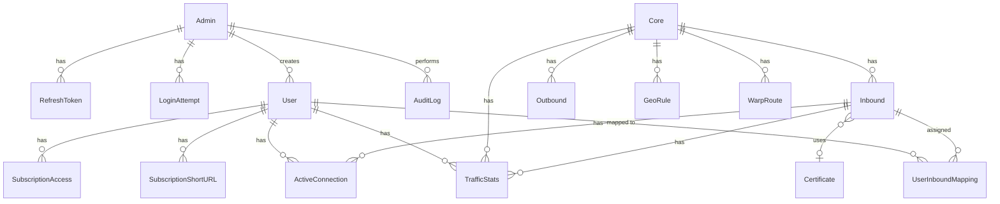
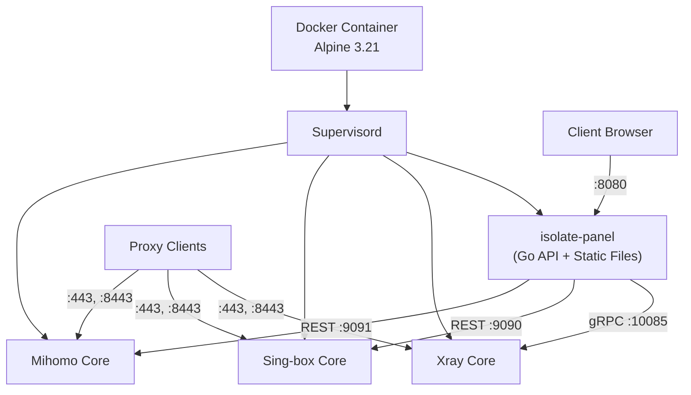

# Isolate Panel — Полный анализ проекта

## 1. Что из себя представляет

**Isolate Panel** — это самостоятельная (self-hosted) административная веб-панель для управления **прокси-серверами** на базе нескольких ядер (proxy cores). Панель предоставляет единый интерфейс для конфигурирования, мониторинга и управления тремя прокси-ядрами одновременно:

| Ядро | Описание |
|------|----------|
| **Xray-core** | Продвинутое ядро V2Ray с поддержкой VLESS, XTLS, REALITY |
| **Sing-box** | Универсальная прокси-платформа нового поколения |
| **Mihomo** (Clash.Meta) | Мета-ядро на базе Clash с расширенной поддержкой протоколов |

По концепции это аналог таких панелей как **Marzban**, **3x-ui**, **Hiddify**, но с ключевым отличием — **поддержка трёх разных ядер** в одном интерфейсе с унифицированным управлением пользователями, подписками и трафиком.

---

## 2. Для чего нужен

**Целевая аудитория**: Администраторы VPS-серверов, предоставляющие прокси-сервисы пользователям.

**Основные задачи**:
- Централизованное управление несколькими прокси-ядрами с единого UI
- Управление пользователями: создание, квотирование трафика, ограничение по дате
- Генерация подписок (subscription links) для клиентских приложений (V2Ray, Clash, Sing-box)
- Мониторинг трафика и активных соединений в реальном времени
- Автоматическое управление TLS-сертификатами через ACME (Let's Encrypt / ZeroSSL)
- Маршрутизация через Cloudflare WARP и GeoIP/GeoSite правила
- Уведомления (Telegram, Webhook) о критических событиях
- Резервное копирование и восстановление конфигурации

---

## 3. Стек технологий

### Backend
| Технология | Версия | Назначение |
|-----------|--------|------------|
| **Go** | 1.25.5 | Язык бэкенда |
| **GoFiber v3** | 3.1.0 | HTTP-фреймворк (на базе fasthttp) |
| **GORM** | 1.31.1 | ORM для работы с БД |
| **SQLite** | — | Встроенная база данных (через `mattn/go-sqlite3`) |
| **golang-jwt/jwt** | v5 | JWT-аутентификация (Access + Refresh tokens) |
| **Argon2id** | — | Хеширование паролей администраторов (`golang.org/x/crypto`) |
| **pquerna/otp** | 1.5.0 | TOTP (двухфакторная аутентификация) |
| **go-acme/lego** | v4 | ACME-клиент для автоматических SSL-сертификатов |
| **zerolog** | 1.34.0 | Структурированное логирование |
| **dgraph-io/ristretto** | 0.2.0 | Высокопроизводительный in-memory кэш |
| **robfig/cron** | v3 | Планировщик задач (бэкапы, сброс трафика) |
| **spf13/viper** | 1.21.0 | Управление конфигурацией (YAML + env vars) |
| **golang-migrate** | v4 | Миграции базы данных |
| **xray-core** | — | Интеграция с Xray API (gRPC stats) |
| **gorilla/websocket** | — | WebSocket для реального времени |
| **swaggo/swag** | — | Генерация Swagger/OpenAPI документации |
| **go-qrcode** | — | Генерация QR-кодов для подписок |
| **WireGuard wgctrl** | — | Интеграция с WARP (WireGuard) |
| **lumberjack** | v2 | Ротация лог-файлов |
| **go-playground/validator** | v10 | Валидация входных данных |

### Frontend
| Технология | Версия | Назначение |
|-----------|--------|------------|
| **Preact** | 10.29.0 | UI-фреймворк (лёгковесная альтернатива React) |
| **TypeScript** | 5.9.3 | Типизированный JavaScript |
| **Vite** | 6.0.11 | Сборщик и dev-сервер |
| **TailwindCSS** | 4.2.2 | Утилитарный CSS-фреймворк |
| **Zustand** | 5.0.12 | Стейт-менеджмент (auth, theme, toast stores) |
| **Axios** | 1.13.6 | HTTP-клиент |
| **i18next** | 25.10.5 | Интернационализация (EN, RU, ZH) |
| **Chart.js** + react-chartjs-2 | — | Графики трафика на Dashboard |
| **Zod** | 4.3.6 | Валидация схем на клиенте |
| **Lucide** | — | Иконки |
| **Sonner** | — | Toast-уведомления |
| **Tippy.js** | — | Тултипы |

### Тестирование
| Технология | Назначение |
|-----------|------------|
| **Vitest** | Unit/integration тесты frontend |
| **Playwright** | E2E тесты (mock API + live API) |
| **Testing Library** (Preact) | Тестирование компонентов |
| **testify** (Go) | Unit-тесты backend |
| **goleak** | Детекция goroutine leaks |
| **k6** | Нагрузочное тестирование |

### Инфраструктура / DevOps
| Технология | Назначение |
|-----------|------------|
| **Docker** | Контейнеризация (multi-stage build: Go → Node → Alpine 3.21) |
| **Docker Compose** | Оркестрация (prod, dev, test конфигурации) |
| **Supervisord** | Управление процессами внутри контейнера (panel + 3 cores) |
| **GitHub Actions** | CI/CD |
| **Air** | Hot-reload Go-бэкенда при разработке |

### CLI
| Технология | Назначение |
|-----------|------------|
| **Cobra** | CLI-фреймворк (команды: `auth`, `user`, `cert`, `backup`, `core`, `inbound`, `outbound`, `stats`) |

---

## 4. Полная функциональность

### 4.1. Аутентификация и авторизация

| Функция | Детали |
|---------|--------|
| **JWT-аутентификация** | Access token (15 мин) + Refresh token (7 дней) |
| **Argon2id** хеширование паролей | Конфигурируемые параметры: time, memory (64MB), threads, key_length |
| **TOTP 2FA** | Двухфакторная аутентификация через TOTP (QR-код) |
| **Rate limiting** | Защита от brute-force |
| **Логирование попыток входа** | `LoginAttempt` — IP, user-agent, success/fail, timestamp |
| **Refresh token rotation** | Привязка к IP и user-agent |
| **Сессия защита** | Auto-detect session expiry на клиенте |
| **Super admin** | Разделение прав: обычный admin vs super admin |

---

### 4.2. Управление пользователями (Users)

| Поле / Функция | Описание |
|---------------|----------|
| **UUID** | Уникальный идентификатор пользователя (используется как credentials в протоколах) |
| **Subscription Token** | Отдельный токен для доступа к подписке |
| **Token** | Опциональный дополнительный токен (для TUIC, Snell и др.) |
| **Квота трафика** | `traffic_limit_bytes` (NULL = безлимит) + `traffic_used_bytes` |
| **Дата истечения** | `expiry_date` (NULL = бессрочно) |
| **Статус Online/Offline** | Отслеживание активности |
| **Привязка к Inbound'ам** | Через `UserInboundMapping` (многие-ко-многим) |
| **Создание админом** | Привязка к создавшему администратору |
| **Сброс трафика** | Планировщик автоматического сброса |

---

### 4.3. Управление ядрами (Cores)

| Функция | Описание |
|---------|----------|
| **Три ядра** | Xray, Sing-box, Mihomo — управляются через Supervisord XML-RPC |
| **Start / Stop / Restart** | Полный lifecycle management |
| **Health check** | TCP port probing после запуска (ожидание, что порт слушает) |
| **Получение статуса** | Реальный PID, uptime, restart count, last error |
| **Auto-restart** | Через Supervisord (autorestart=true) |
| **Генерация конфигов** | Каждое ядро имеет свой `config.go` для трансляции unified-моделей в native формат |

**Конфигурация каждого ядра включает**:
- Xray: JSON-конфигурация с gRPC stats API (порт 10085)
- Sing-box: JSON-конфигурация с REST API (порт 9090)
- Mihomo: YAML-конфигурация с REST API (порт 9091)

---

### 4.4. Протоколы (Protocol Registry)

Унифицированный реестр протоколов с описанием параметров, совместимости с ядрами и direction (inbound/outbound/both):

#### Inbound + Outbound (both)
| Протокол | Ядра | Category |
|----------|------|----------|
| HTTP Proxy | sing-box, xray, mihomo | proxy |
| SOCKS5 | sing-box, xray, mihomo | proxy |
| Shadowsocks | sing-box, xray, mihomo | proxy |
| VMess | sing-box, xray, mihomo | proxy |
| VLESS | sing-box, xray, mihomo | proxy |
| Trojan | sing-box, xray, mihomo | proxy |
| Hysteria 2 | sing-box, xray, mihomo | tunnel |
| TUIC v4 | sing-box, mihomo | tunnel |
| TUIC v5 | sing-box, mihomo | tunnel |
| ShadowsocksR | mihomo | proxy |
| Snell | mihomo | tunnel |
| Mieru | mihomo | tunnel |
| Sudoku | mihomo | tunnel |
| TrustTunnel | mihomo | tunnel |

#### Inbound Only
| Протокол | Ядра | Category |
|----------|------|----------|
| Mixed (HTTP+SOCKS5) | sing-box, mihomo | proxy |
| NaiveProxy | sing-box | proxy |
| Redirect | sing-box, mihomo | utility |
| XHTTP | xray | proxy |

#### Outbound Only
| Протокол | Ядра | Category |
|----------|------|----------|
| Direct | все | utility |
| Block (blackhole) | все | utility |
| DNS | все | utility |
| Hysteria v1 | все | tunnel |
| Tor | sing-box | tunnel |
| MASQUE | mihomo | proxy |

**Каждый протокол** имеет:
- Типизированные параметры (string, integer, boolean, select, uuid, array)
- Auto-generation функции для credentials (UUID v4, base64 tokens, passwords)
- Зависимости между параметрами (`DependsOn`)
- Поддержку транспортов (websocket, grpc, http, httpupgrade)
- TLS/REALITY конфигурацию

---

### 4.5. Inbound'ы (Входящие соединения)

| Функция | Описание |
|---------|----------|
| **CRUD операции** | Создание, чтение, обновление, удаление inbound'ов |
| **Привязка к ядру** | Каждый inbound принадлежит конкретному Core |
| **TLS** | Поддержка TLS с привязкой к сертификату |
| **REALITY** | Поддержка XTLS REALITY (конфигурация в JSON) |
| **Порт** | Управление портами с автоматическим назначением |
| **ConfigJSON** | Дополнительная конфигурация в JSON-формате |
| **Привязка пользователей** | Назначение пользователей через `UserInboundMapping` |
| **Включение/Отключение** | Флаг `is_enabled` |

---

### 4.6. Outbound'ы (Исходящие соединения)

| Функция | Описание |
|---------|----------|
| **CRUD** | Полное управление исходящими правилами |
| **Приоритет** | Числовой приоритет для порядка обработки |
| **Привязка к ядру** | Связь с конкретным Core |

---

### 4.7. Подписки (Subscriptions)

Генерация конфигураций для клиентских приложений в **3 форматах**:

| Формат | Описание |
|--------|----------|
| **V2Ray** | Base64-encoded список URI-ссылок (vless://, vmess://, trojan://, ss://, hy2://, tuic://, naive+https://, ssr://, socks5://, http://, mixed://) |
| **Clash** | YAML-конфигурация с proxy-groups и правилами |
| **Sing-box** | JSON-конфигурация с outbound'ами и selector |

**Дополнительные возможности**:
- **Short URL** — короткие ссылки для подписок
- **Access logging** — логирование каждого обращения к подписке (IP, user-agent, формат, время, подозрительность)
- **Статистика доступа** — total accesses, по форматам, по дням, уникальные IP
- **QR-коды** — генерация для мобильных клиентов
- **Token regeneration** — перегенерация subscription_token
- **Кэширование** — In-memory кэш подписок с инвалидацией

---

### 4.8. Статистика и мониторинг

| Компонент | Описание |
|-----------|----------|
| **Traffic Stats** | Upload/Download/Total по user + inbound + core, с гранулярностью (raw/hourly/daily) |
| **Active Connections** | Реальные соединения: source/destination IP:port, start time, upload/download per connection |
| **Traffic Collector** | Периодический сбор статистики с API каждого ядра |
| **Data Aggregator** | Агрегация raw-данных в hourly/daily |
| **Data Retention** | Автоматическая очистка старых данных |
| **Connection Tracker** | Отслеживание активных соединений |
| **Quota Enforcer** | Контроль лимитов трафика и деактивация пользователей |
| **System Resources** | CPU и RAM мониторинг сервера |
| **WebSocket** | Реальное время — обновления трафика и статуса |
| **Monitoring Mode** | `lite` (60s interval, ~30MB RAM) vs `full` (10s interval, ~100MB RAM) |

**Stats clients** для каждого ядра:
- **Xray**: gRPC API (порт 10085) — запрос `QueryStats` через protobuf
- **Sing-box**: REST API (порт 9090) — `/connections`
- **Mihomo**: REST API (порт 9091) — `/connections` + `/traffic`

---

### 4.9. TLS-сертификаты (ACME)

| Функция | Описание |
|---------|----------|
| **Автоматическое получение** | Let's Encrypt / ZeroSSL через ACME HTTP-01 challenge |
| **Wildcard** | Поддержка wildcard-сертификатов (*.domain.com) |
| **DNS провайдеры** | Cloudflare, Route53 и другие |
| **Авто-обновление** | Автоматическое renewal через cron |
| **Статусы** | pending → active → expiring → expired / revoked |
| **Хранение** | Cert/Key/Issuer файлы на диске, пути в БД |

---

### 4.10. WARP-маршрутизация

| Функция | Описание |
|---------|----------|
| **WarpRoute** | Правила маршрутизации через Cloudflare WARP |
| **Типы ресурсов** | domain, ip, cidr |
| **Приоритет** | 1-100, управляемый порядок |
| **Geo-интеграция** | Интеграция WARP с GeoIP-данными |
| **WireGuard** | Интеграция через `wgctrl` |

---

### 4.11. GeoIP/GeoSite правила

| Функция | Описание |
|---------|----------|
| **GeoRule** | Правила на основе GeoIP (страна) или GeoSite (категория) |
| **Действия** | proxy, direct, block, warp |
| **Приоритет** | 1-100 |
| **Geo-сервис** | Загрузка и обновление GeoIP/GeoSite баз данных |

---

### 4.12. Резервное копирование (Backups)

| Функция | Описание |
|---------|----------|
| **Manual backup** | Ручное создание бэкапа |
| **Scheduled backup** | Планирование через cron (`BackupScheduler`) |
| **Типы** | full, manual, scheduled |
| **Включения** | БД, конфиги ядер, сертификаты, WARP, GeoIP данные |
| **Шифрование** | Опциональное шифрование бэкапов |
| **Контрольная сумма** | SHA-256 для проверки целостности |
| **Метаданные** | Версия панели, миграция БД, hostname, timestamp |
| **Восстановление** | Полное восстановление из бэкапа |
| **Destination** | Локальное хранение (расширяемо) |

---

### 4.13. Уведомления (Notifications)

| Канал | Описание |
|-------|----------|
| **Telegram Bot** | Уведомления через Telegram (bot token + chat ID) |
| **Webhook** | HTTP webhook с подписью секретом |

**Типы событий**:
- `quota_exceeded` — превышение лимита трафика
- `expiry_warning` — приближение даты истечения
- `cert_renewed` — обновление сертификата
- `core_error` — ошибка прокси-ядра
- `failed_login` — неудачная попытка входа
- `user_created` — создание пользователя
- `user_deleted` — удаление пользователя

**Механика**: retry (до 3x) с exponential backoff, статусы (pending → sent / failed), гранулярные toggle'ы для каждого типа.

---

### 4.14. Аудит (Audit Log)

| Функция | Описание |
|---------|----------|
| **AuditLog** | Запись действий администраторов |
| **Поля** | admin_id, action (user.create), resource, resource_id, details (JSON), IP, timestamp |
| **API** | Лента аудита с фильтрацией |

---

### 4.15. Настройки приложения (Settings)

| Функция | Описание |
|---------|----------|
| **Key-Value store** | Динамические настройки в БД |
| **Типизация** | `value_type`: string, number, boolean... |
| **API** | Batch get/set настроек |

---

### 4.16. WebSocket — Real-time обновления

| Функция | Описание |
|---------|----------|
| **WebSocket endpoint** | Подключение к `/ws` для получения обновлений |
| **Данные** | Трафик, статусы ядер, активные соединения |
| **Клиент** | `useWebSocket` hook на фронтенде |

---

### 4.17. Интернационализация (i18n)

| Язык | Файл |
|------|------|
| English | `en.json` (18.6 KB) |
| Русский | `ru.json` (28 KB) |
| 中文 (Chinese) | `zh.json` (17.6 KB) |

---

### 4.18. CLI-утилита (`isolate-cli`)

Отдельный Go-модуль с командами:

| Команда | Описание |
|---------|----------|
| `auth` / `login` | Аутентификация в панели |
| `user` | CRUD пользователей |
| `cert` | Управление сертификатами |
| `backup` | Создание/восстановление бэкапов |
| `core` | Start/Stop/Restart/Status ядер |
| `inbound` | Управление inbound'ами |
| `outbound` | Управление outbound'ами |
| `stats` | Просмотр статистики |
| `docs` | Генерация документации |
| `completion` | Shell completions (bash, zsh, fish, powershell) |

---

## 5. Архитектура

### Структура бэкенда (Clean Architecture)

```
backend/
├── cmd/
│   ├── server/       # Точка входа API-сервера
│   └── migrate/      # Утилита миграций
├── internal/
│   ├── api/          # HTTP handlers (29 файлов)
│   ├── app/          # Application bootstrap
│   ├── acme/         # ACME-клиент для Let's Encrypt
│   ├── auth/         # JWT + Argon2id + TOTP
│   ├── cache/        # In-memory кэш (Ristretto)
│   ├── config/       # Viper-конфигурация
│   ├── cores/        # Управление прокси-ядрами + конфиг-генераторы
│   │   ├── xray/     # Xray config builder + gRPC stats client
│   │   ├── singbox/  # Sing-box config builder + REST stats client
│   │   └── mihomo/   # Mihomo config builder + REST stats client
│   ├── database/     # SQLite + GORM + миграции + seeds
│   ├── logger/       # Zerolog + lumberjack
│   ├── middleware/    # Auth, CORS, Rate limit, Audit, Security, Recovery
│   ├── models/       # Data models (14 файлов)
│   ├── protocol/     # Protocol Registry — unified protocol definitions
│   ├── scheduler/    # Cron: backup + traffic reset
│   ├── services/     # Business logic (26 файлов)
│   ├── stats/        # Statistics aggregation
│   └── version/      # Version info
└── configs/          # YAML-конфигурация
```

### Структура фронтенда

```
frontend/src/
├── api/              # Axios client + endpoint modules
├── components/
│   ├── features/     # Доменные компоненты
│   ├── forms/        # Форм-компоненты
│   ├── layout/       # Layout + ErrorBoundary
│   ├── ui/           # UI Kit (Toast, PageSkeleton, etc.)
│   └── views/        # View-компоненты
├── hooks/            # 22 custom hooks (useQuery, useMutation, useWebSocket...)
├── i18n/             # i18next + 3 локали
├── pages/            # 19 Page-компонентов
├── router/           # ProtectedRoute
├── stores/           # Zustand stores (auth, theme, toast)
├── styles/           # CSS-модули
├── types/            # TypeScript interfaces
└── utils/            # Утилиты
```

---

## 6. Модель данных (Database Schema)



**Таблицы**: `admins`, `refresh_tokens`, `login_attempts`, `users`, `user_inbound_mapping`, `cores`, `inbounds`, `outbounds`, `certificates`, `traffic_stats`, `active_connections`, `warp_routes`, `geo_rules`, `backups`, `notifications`, `notification_settings`, `settings`, `audit_logs`, `subscription_short_urls`, `subscription_accesses`

---

## 7. Деплой-инфраструктура



**Docker multi-stage build**:
1. **Go Builder** → компиляция `server` и `isolate-migrate`
2. **Node.js Builder** → сборка Preact SPA (`npm run build`)  
3. **Alpine 3.21** → финальный образ со всеми бинарниками + `setcap cap_net_bind_service`

**Конфигурации**: `docker-compose.yml` (prod), `docker-compose.dev.yml` (dev с hot-reload), `docker-compose.test.yml` (тесты)

---

## 8. Тестирование

| Уровень | Инструмент | Покрытие |
|---------|-----------|----------|
| **Backend unit tests** | `go test` + testify | Models, services, API handlers, middleware, auth, protocol, cache, scheduler, cores |
| **Backend integration** | `go test` | Cores, backup service |
| **Frontend unit tests** | Vitest + Testing Library | Stores, hooks (useForm, useMutation, useQuery, useSessionExpired), pages |
| **Frontend E2E (mock)** | Playwright | Auth flow, navigation, dashboard, users, inbounds, cores, backups, settings, full scenario |
| **Frontend E2E (live)** | Playwright (live config) | Тесты против реального backend |
| **Load testing** | k6 | Сценарии нагрузки |
| **Goroutine leak detection** | goleak | Предотвращение утечек горутин |
